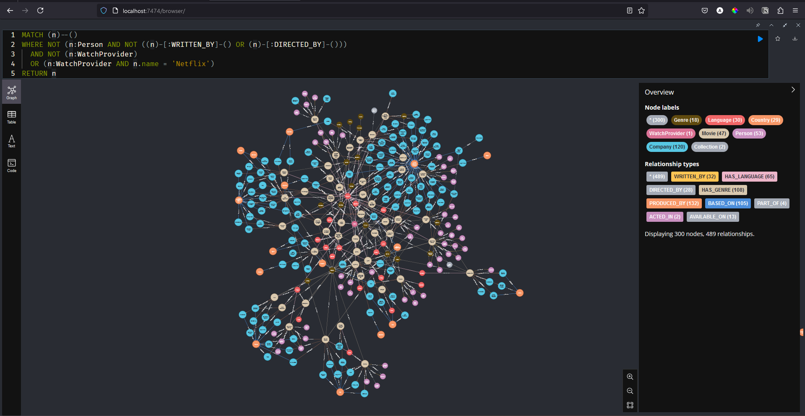

 

<h2 align="center">Movie ETL</h2>
  

    Data pipeline to transform a raw movie data into a Knowledge Graph.
     
  

## About The Project
The rise of Large Language Models (LLMs) has transformed NLP, but challenges like hallucination and limited reasoning highlight the need for structured knowledge. Knowledge Graphs (KGs) provide context and interpretability, complementing LLMs effectively. However, KGs is not common dataset that easily we can get on the internet, making their adoption difficult.

This project simplifies KG creation by building an ETL pipeline to transform movie data into a structured Knowledge Graph.

Here is an example of the knowledge graph created from the pipeline:

## Tools Used
1. [Neo4j Database](https://neo4j.com/)
2. [Prefect](https://docs.prefect.io/v3/get-started/index)